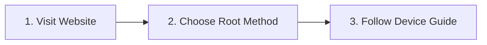

<picture>
  <source media="(prefers-color-scheme: light)" srcset="https://awesome-android-root.org/images/logo.svg">
  <source media="(prefers-color-scheme: dark)" srcset="https://awesome-android-root.org/images/logo_dark.svg">
  
</picture>

# Awesome Android Root

**The Complete Hub for Android Root Solutions & Advanced Customization**

**[Explore Apps](https://awesome-android-root.org/android-root-apps/) • [Read Guides](https://awesome-android-root.org/android-root-guides/) • [Join Community](https://github.com/orgs/awesome-android-root/discussions)**

---

## What We Offer

A comprehensive collection of **430+ root applications and modules**, expert rooting guides, and detailed documentation for Android enthusiasts worldwide.

### Key Features

- **Curated Collection** — Over 430 tested applications across 25+ categories
- **Complete Guides** — Step-by-step tutorials for all skill levels
- **Safety First** — Best practices and risk mitigation strategies
- **Always Updated** — Full Android 14/15 compatibility
- **Open Source** — Transparent and collaborative development

 

## Get Started

Complete beginner? Our website has everything you need : **[🚀 Start Here](https://awesome-android-root.org/android-root-guides/)**

---

#### **Getting Started:**
[What is Rooting?](https://awesome-android-root.org/android-root-guides/#what-is-android-rooting) • [Choose Your Method](https://awesome-android-root.org/android-root-guides/#rooting-methods) • [Safety First](https://awesome-android-root.org/faqs#is-rooting-safe)

#### **Popular Devices:**

[Pixel](https://awesome-android-root.org/android-root-guides/how-to-root-pixel-phone) • 
[Samsung](https://awesome-android-root.org/android-root-guides/how-to-root-samsung-phone) • 
[Xiaomi](https://awesome-android-root.org/android-root-guides/how-to-root-xiaomi-phone) • 
[OnePlus](https://awesome-android-root.org/android-root-guides/how-to-root-oneplus-phone) • 
[Nothing](https://awesome-android-root.org/android-root-guides/how-to-root-nothing-phone) • 
[More →](https://awesome-android-root.org/android-root-guides/#device-specific-guides)

---

## Community Stats

 

## Resources & Support

 

**[Website](https://awesome-android-root.org)** • **[FAQ](https://awesome-android-root.org/faqs)** • **[Troubleshooting](https://awesome-android-root.org/troubleshooting)** • **[Contributing](https://awesome-android-root.org/contributing)**

> **Warning:** Rooting voids warranty and may introduce security risks. [Read our safety guidelines](https://awesome-android-root.org/faqs#is-rooting-safe) before proceeding.

---

**Visit [awesome-android-root.org](https://awesome-android-root.org) for the full experience**

Licensed under [MIT](LICENSE) • [Code of Conduct](.github/CODE_OF_CONDUCT.md)

